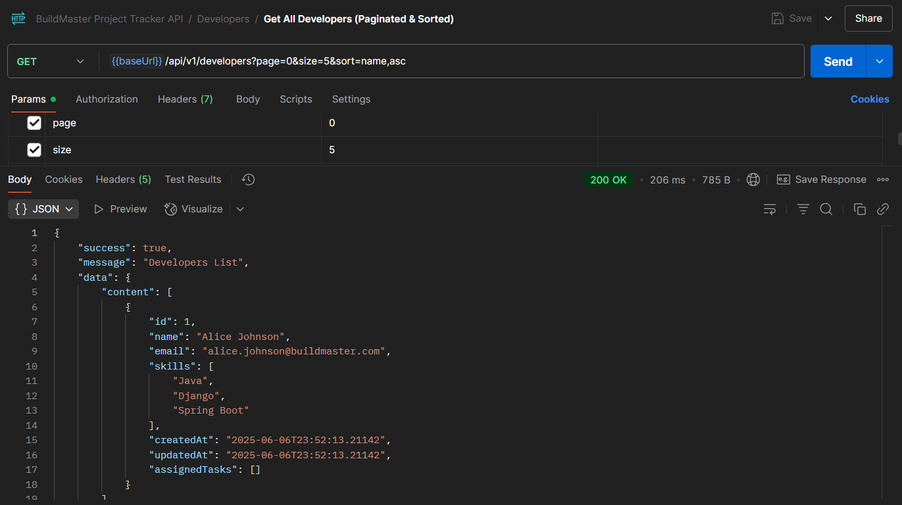
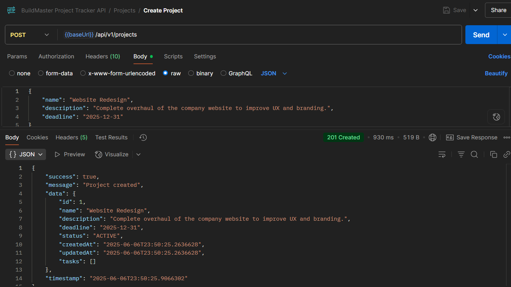
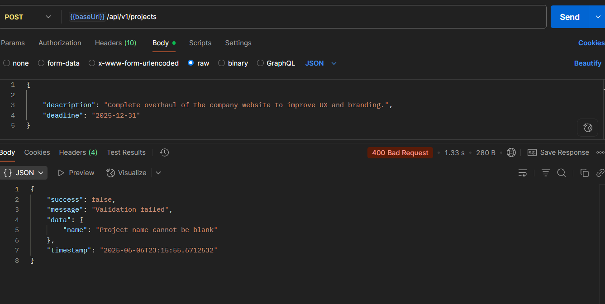

# BuildMaster Project Tracker API

## Project Overview

The BuildMaster Project Tracker API is a robust backend solution designed to help the growing startup "BuildMaster" gain visibility into team performance and progress across various projects and tasks. This API provides a centralized system for tracking projects, managing tasks, and assigning them to developers, ensuring efficient project oversight and team collaboration.

## Key Features

- **Multi-Entity Tracking**: Manages Projects, Developers, and Tasks with proper relational mapping (One-to-Many, Many-to-One)
- **CRUD Operations**: Full RESTful API for creating, reading, updating, and deleting projects, developers, and tasks
- **Pagination & Sorting**: Efficiently retrieve large datasets with built-in pagination and sorting capabilities
- **Caching**: Leverages Spring Cache with Caffeine to optimize performance for frequently accessed data, reducing database load
- **Transaction Management**: Ensures data consistency and integrity for multi-entity operations using Spring's `@Transactional` annotations
- **Audit Logging (NoSQL Integration)**: All significant data changes (create, update, delete) on Projects, Developers, and Tasks are logged to a MongoDB instance, providing a scalable audit trail
- **Advanced Querying**: Supports complex queries to identify overdue tasks, top developers by task count, projects without tasks, and task counts by status
- **Email Notifications**: Sends email alerts to developers upon task assignment 
- **API Versioning**: Implemented with URI path versioning (`/api/v1/`)
- **API Documentation**: Self-documenting API using Swagger/OpenAPI for easy exploration and testing

## Security Features and Usage

The Project Tracker API is now secured with Spring Security, JWT authentication, and OAuth2/OpenID Connect login.

### 1. User Roles

The system defines the following roles:
* `ROLE_ADMIN`: Full access, manages users, views audit logs.
* `ROLE_MANAGER`: Can create/manage projects, assign tasks.
* `ROLE_DEVELOPER`: Can view all projects and tasks, but only update tasks assigned to them. Default role for local registrations.
* `ROLE_CONTRACTOR`: Read-only access to project summaries. Default role for OAuth2 logins.

### 2. Local User Authentication (Email/Password)

**a. User Registration:**
* **Endpoint:** `POST /auth/register`
* **Purpose:** Create a new local user account.
* **Request Body:**
    ```json
    {
        "email": "newuser@example.com",
        "password": "securepassword123"
    }
    ```
* **Default Role:** New local users are assigned `ROLE_DEVELOPER` by default.

**b. User Login:**
* **Endpoint:** `POST /auth/login`
* **Purpose:** Authenticate a local user and receive a JWT token.
* **Request Body:**
    ```json
    {
        "email": "newuser@example.com",
        "password": "securepassword123"
    }
    ```
* **Response:**
    ```json
    {
        "accessToken": "eyJhbGciOiJIUzI1Ni...",
        "tokenType": "Bearer",
        "refreshToken": "eyuuasdJosd....",
        "expiresIn": 900, // Token validity in seconds (e.g., 15 minutes)
        "role": "ROLE_DEVELOPER"
    }
    ```
  Store this `accessToken`.

### 3. API Access with JWT

For all protected endpoints (most endpoints under `/api/v1/`), you must include the JWT in the `Authorization` header:

* **Header:** `Authorization`
* **Value:** `Bearer <your_jwt_token>` (e.g., `Bearer eyJhbGciOiJIUzI1Ni...`)

### 4. OAuth2 Login Integration (Google / GitHub)

* **Initiate Login:**
   * **Google:** Access `http://localhost:8080/oauth2/authorization/google`
   * **GitHub:** Access `http://localhost:8080/oauth2/authorization/github`
* **Flow:**
   1.  Your browser will redirect to the respective OAuth2 provider's login/consent page.
   2.  After successful authentication and consent, the provider will redirect back to your application's callback URL (e.g., `http://localhost:8080/login/oauth2/code/google`).
   3.  Your application will handle this callback, provision/update the user locally (assigning `ROLE_CONTRACTOR` by default for new OAuth2 users), and then respond with a JWT in the JSON body (similar to the local login response).
* **Important Configuration:**
   * Ensure `spring.security.oauth2.client.registration.google.client-id`, `client-secret` (and similarly for GitHub) are correctly set in `application.properties`.
   * The `redirect-uri` in `application.properties` MUST match the authorized redirect URI configured in your Google Cloud Console / GitHub OAuth Apps settings.

### 5. Role-Based Access Control Examples

* `POST /api/v1/projects`: Requires `ROLE_ADMIN` or `ROLE_MANAGER`.
* `PUT /api/v1/tasks/{id}`: Requires `ROLE_ADMIN` or `ROLE_MANAGER`, OR the authenticated `ROLE_DEVELOPER` must be assigned to the task.
* `DELETE /api/v1/users/{id}`: Requires `ROLE_ADMIN`.
* `GET /api/v1/logs`: Requires `ROLE_ADMIN`.
* `GET /api/v1/projects/{id}/summary`: Accessible to all authenticated users (including `ROLE_CONTRACTOR`).

### 6. Swagger UI Security

* Access Swagger UI at `http://localhost:8080/swagger-ui.html`.
* Only accessible to ADMIN users.
* Click the "Authorize" button (global security definitions are present).
* In the dialog, enter your JWT token (prefixed with `Bearer `) obtained from `/auth/login` or OAuth2 callback. This will allow you to test protected endpoints directly from Swagger UI.


## System Requirements

To run this application locally, you will need:

- Java 24
- Maven 3.6.0 or higher
- MongoDB Community Server (running locally or accessible via a URI)
- Docker Desktop / Docker Engine (if you plan to run the application in a Docker container)
- Postman or a similar API client for testing endpoints

## Installation and Setup

You can run this application either directly on your machine or using Docker.

### 1. Database Setup (MongoDB and H2)

This application uses two databases:

- **PostgreSQL Database (Relational)**: For Project, Developer, and Task data. 
- **MongoDB (NoSQL)**: For Audit Logs. You must have a MongoDB instance running.

#### MongoDB Local Setup:

1. **Install MongoDB Community Server**: Follow the official MongoDB installation guides for your operating system: https://docs.mongodb.com/manual/installation/
2. **Start MongoDB**: Ensure the `mongod` service is running (e.g., `sudo systemctl start mongod` on Linux, or check Services on Windows)
3. **Verify Connection**: Use MongoDB Compass or the `mongosh` shell to connect to `mongodb://localhost:27017` and confirm it's accessible
4. **Firewall** (if applicable): Ensure your firewall allows incoming connections on port 27017 if you face connection issues

### 2. Application Configuration

Before running, configure and confirm database URIs.

1. Open `src/main/resources/application.properties`
2. **MongoDB URI**: Ensure `spring.data.mongodb.uri=mongodb://localhost:27017/auditlogsdb` points to your running MongoDB instance
3. **PostgreSQL** : 

```properties
spring.datasource.url=jdbc:postgresql://localhost:5432/db_name
spring.datasource.username=db_user
spring.datasource.password=user_password
spring.datasource.driverClassName=org.postgresql.Driver
```

### 3. Running the Application

#### Option A: Running Directly (Spring Boot JAR)

1. **Clone the repository**:
   ```bash
   git clone https://github.com/Moadams/ProjectTracker.git
   cd project-tracker
   ```

2. **Build the project**:
   ```bash
   mvn clean install -DskipTests
   ```

3. **Run the application**:
   ```bash
   mvn spring-boot:run
   ```

The application will start on http://localhost:8080.

#### Option B: Running with Docker

1. **Ensure Docker is running** on your machine
2. **Place the Dockerfile**: Make sure the Dockerfile (provided in the project) is in the root directory of your project
3. **Build the Docker image**:
   Open your terminal in the project root and run:
   ```bash
   docker-compose up --build
   ```
   This will create a lean Docker image for your application.

4. **Run the Docker container**:

Your application will be accessible via http://localhost:5000 from your host machine.

## API Documentation (Swagger/OpenAPI)

Once the application is running (either directly or via Docker), you can access the interactive API documentation:

**Open your web browser and go to**: http://localhost:8080/swagger-ui.html

This interface allows you to explore all available endpoints, view their expected request/response formats, and even send test requests directly from the browser.

## Testing with Postman

A Postman collection is available to help you quickly test all the API endpoints.

1. **Download the Postman Collection JSON**: (You would place the JSON provided earlier here, e.g., link to a file or embed it)

### Example responses



